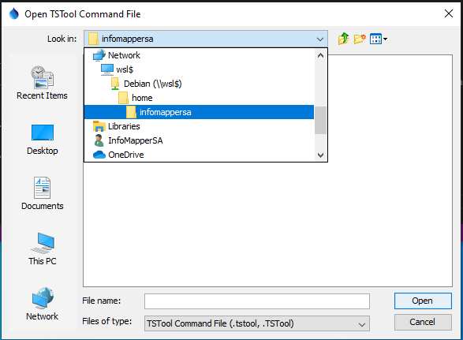
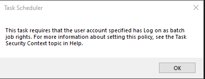
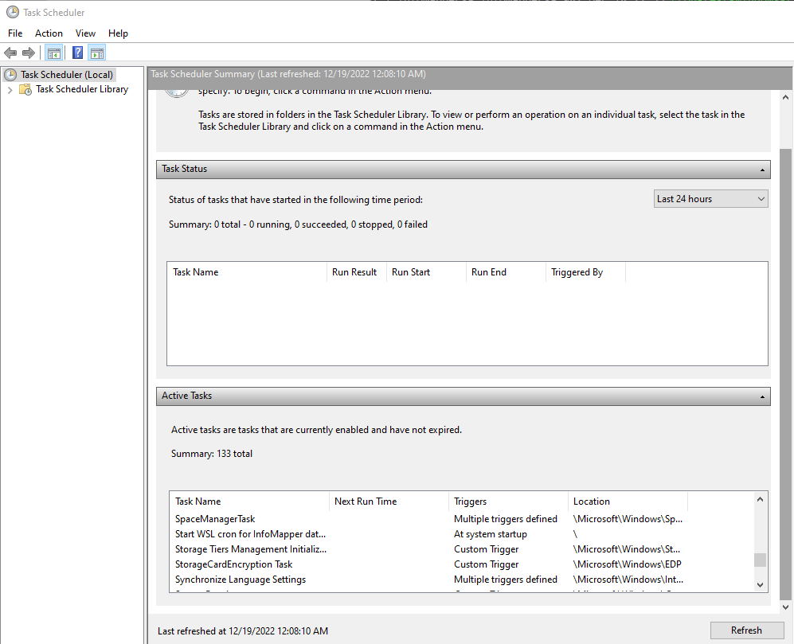
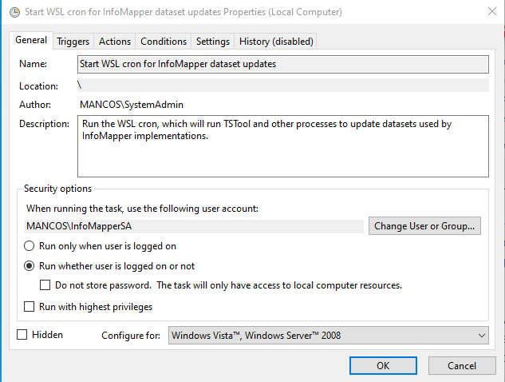

# `cron` on Windows Subsystem for Linux (WSL)
After installation, the program is `C:\Windows\System32\wsl.exe`.

This documentation explains how to set up the `cron` service on the Windows Subsystem for Linux.
The documentation uses the `InfoMapperSA` service account as the user,
which is used to update datasets for OWF's [InfoMapper](https://software.openwaterfoundation.org/infomapper/latest/doc-user/) software.
The TSTool software developed by OWF is used to run automated workflows
(see the [TSTool download page](https://opencdss.state.co.us/tstool/)).

**The initial version of this documentation was created on 2022-12-20 and will be updated as additional machines are configured.
Unfortunately, the experience documented below was not linear
and one or more passes on other machines may be needed to improve the documentation.**

*   [Introduction](introduction)
*   [Windows Computer Setup](#windows-computer-setup)
    +   [Select a Machine](#select-a-machine)
    +   [Create Windows Account](#create-windows-account)
    +   [Install Windows Software Tools](#install-windows-software-tools)
    +   [Install Windows Subsystem for Linux](#install-windows-subsystem-for-linux)
        -   [Check the Windows Version](#check-the-windows-version)
        -   [Install `wsl 2`](#install-wsl-2)
        -   [Determine which Linux Distribution to Install](#determine-which-linux-distribution-to-install)
        -   [Install a Linux Distribution on WSL](#install-a-linux-distribution-on-wsl)
        -   [Login to a Linux Terminal Window](#login-to-a-linux-terminal-window)
*   [WSL Linux Setup](#wsl-linux-setup)
    +   [Configure the Linux User Environment](#configure-the-linux-user-environment)
    +   [Install Linux Software Tools](#install-linux-software-tools)
*   [Run the Windows TSTool from Linux](#run-the-windows-tstool-from-linux)
    +   [Run the Windows TSTool from the Linux Distribution](#run-the-windows-tstool-from-the-linux-distribution)
    +   [Run the Windows TSTool from WSL Linux Distribution `cron`](#run-the-windows-tstool-from-wsl-linux-distribution-cron)
*   [Run the Linux TSTool from Linux](#run-the-linux-tstool-from-linux)
    +   [Run the Linux TSTool from the Linux Distribution](#run-the-linux-tstool-from-the-linux-distribution)
    +   [Run the Linux TSTool from WSL Linux Distribution `cron`](#run-the-linux-tstool-from-wsl-linux-distribution-cron)

--------------

## Introduction ##

This documentation describes how to set up a Windows Subsystem for Linux (WSL) machine to run the `cron` service.
The example configuration uses the `InfoMapperSA` service account,
which is used to process datasets for OWF's InfoMapper software.
An alternate account can be used, as appropriate.

WSL version 2 is used.  See the
[Frequently Asked Questions about Windows Subsystem for Linux](https://learn.microsoft.com/en-us/windows/wsl/faq)
article.

Why use this approach instead of just using the Windows scheduler?

*   Windows and Linux programs can be run to accomplish a task.
*   The Linux cron is flexible and straightforward once configured.
*   The Linux crontab file can be saved in version control and shared since it is a simple text file.

Important considerations are:

*   the WSL must be installed for each user and cannot be shared between users on a Windows computer
*   starting the WSL `cron` to run tasks without logging in requires that the user have administrative privileges
    (cannot start the WSL `cron` service using the main Administrator account and then use a service
    account to run WSL programs)
*   the WSL Linux distribution can access Windows files (through `/mnt/c/..`)
*   Windows programs can be run by accessing `/mnt/c/Program Files`, etc.
*   the WSL environment will automatically shut down if it detects no handles to Windows processes; therefore,
    why the `cron` service must be started from the Windows Task Scheduler

This solution may be implemented with other solutions on the same computer (e.g., Cygwin, Windows Scheduler)
but using one primary approach will minimize system administration and implementation effort.

The machine is intended to be used for production work, but not development.
However, installing Git on the production machine may be required to facilitate accessing workflows that are stored in repositories.

## Windows Computer Setup ##

The following sections describe how to set up the Windows computer for WSL.
Subsequent documentation describes how to configure the WSL Linux distribution.

### Select a Machine ###

Automated processes can be run on a computer that is used for other tasks.
However, for this discussion, it is assumed that a dedicated machine is used.
This machine should be sufficiently up to date to allow installation of recent software versions
and powerful enough to run the software described in this documentation.
A low-power machine may be suitable, especially if automated tasks do not need to be run quickly and frequently.

### Create Windows Account ###

Use the Windows administrator account to create a service account (`InfoMapperSA` in this case),
which will be used to run unattended automated workflows.
An email account and Microsoft cloud login is not required,
but can be used if the service account email will be used for notifications or monitoring automated tasks.
The WSL Linux distributions are installed per user and therefore if specific user files and emails are used
multiple WSL installations may be required.

The following configuration changes may be needed or are desirable for the Windows user:

*   Change the Windows ***File Explorer / View*** settings to display file extensions and hidden files to avoid confusion
    when working with configuration and workflow files.

### Install Windows Software Tools ###

Install general productivity software, such as:

*   [Chrome](https://www.google.com/chrome/dr/download/) or other web browser, if the default Windows Edge browser is not enough
*   [GIMP](https://www.gimp.org/downloads/) - to take screen shots for documentation
*   [Visual Studio Code](https://code.visualstudio.com) - to edit text files (alternate text file editor software can be installed as appropriate)

Install software used in automation:

*   [TSTool](https://opencdss.state.co.us/tstool/) - used to process and upload datasets
    +   Needed if running TSTool on Windows from the WSL Linux distribution
    +   Run once to automatically initialize user files on Windows
    +   May need to edit the configuration, for example to disable HydroBase
    +   May need to configure datastores based on which datasets are required for workflows
    +   May need to install TSTool plugins such as the [TSTool AWS Plugin](https://software.openwaterfoundation.org/tstool-aws-plugin/)

Additional setup is described in the following sections.

### Install Windows Subsystem for Linux ###

The Windows Linux Subsystem (WSL) is a self-contained Linux environment running under Windows.
The WSL is installed per Windows user, which in this documentation uses the `InfoMapperSA` service account
that is used for workflow automation.
Running a WSL Linux distribution (or other Linux environment) on Windows is useful
because Linux bash scripts and utilities such as cron and email can be run.

See the [Install Linux on Windows with WSL](https://learn.microsoft.com/en-us/windows/wsl/install) Microsoft documentation
for general information.
For this documentation the latest Debian Linux is used.
The following sections describe the experience of installing and configuring the WSL on an Open Water Foundation computer.

**The process was not clean and may vary for other computers.
In particular, it was found that when problems occurred,
restarting the computer to complete software updates often helped overcome issues.**

**The following was initially run as a normal user by running the Windows command shell "as administrator" and
entering the administrator password.  The `InfoMapperSA` account was later changed to have administrator priveleges
because otherwise the Windows Task Scheduler could not be used to start the `cron` service.
Changing the account to have administrator priveleges up front may have changed some installation steps.**

#### Check the Windows Version ####

Make sure that the computer is running a new enough Windows version as indicated by the WSL installation instructions.
Use the Windows logo key + `R` key and then type `winver` to display the Windows version.
For this documentation the computer is running version 22H2 (OS Build 19045.2364),
which is sufficient to install WSL 2.

If necessary, run Windows updates until the version is sufficient to run WSL 2.

#### Install `wsl 2` ####

Make sure to install `wsl` version 2.
In a Windows command shell that is run as administrator,
execute the following:

```
wsl --install
```

Restart the computer before continuing to ensure that the WSL software is up to date.

After installation, the program is `C:\Windows\System32\wsl.exe`,
which means that the WSL sofware is shared between user accounts;
however, apparently the Linux distributions within the WSL and runtime environments
are specific to each user.

If errors occur, try to go forward with installing a distribution below to
ensure that the WSL software is installed.

#### Determine which Linux Distribution to Install ####

Open a command prompt as administrator and run the following,
which should work if the WSL program was installed:

```
wsl --list --online
The following is a list of valid distributions that can be installed.
The default distribution is denoted by '*'.
Install using 'wsl --install -d <Distro>'.

  NAME               FRIENDLY NAME
* Ubuntu             Ubuntu
  Debian             Debian GNU/Linux
  kali-linux         Kali Linux Rolling
  SLES-12            SUSE Linux Enterprise Server v12
  SLES-15            SUSE Linux Enterprise Server v15
  Ubuntu-18.04       Ubuntu 18.04 LTS
  Ubuntu-20.04       Ubuntu 20.04 LTS
  OracleLinux_8_5    Oracle Linux 8.5
  OracleLinux_7_9    Oracle Linux 7.9
```

Choose a Linux distribution that is appropriate for the tools being run.
For this documentation, `Debian` is selected because the Open Water Foundation
collaborates with solution providers that use `Debian`.
Multiple distributions can be installed at the same time,
but each distribution requires disk space and is available only to the specific Windows account user.

#### Install a Linux Distribution on WSL ####

Next, run a Windows command shell as administrator and install a Linux distribution within the WSL:

```
wsl --install -d Debian
Installing: Debian GNU/Linux
An error occurred during installation. Distribution Name: 'Debian GNU/Linux' Error Code: 0x8000ffff

wsl --status

Default Version: 2

WSL automatic updates are on.

The WSL 2 kernel file is not found. To update or restore the kernel please run 'wsl --update'.
```

From the above it is clear that WSL 2 is at least partially installed.

```
wsl --update
Installing: Windows Subsystem for Linux
Catastrophic failure

echo %ERRORLEVEL%
-1
```

Restart the computer again, which did an update of the WSL.

Then run a Windows command shell as administrator and run the following commands.

```
wsl status
Windows Subsystem for Linux has no installed distributions.
Distributions can be installed by visiting the Microsoft Store:
https://aka.ms/wslstore

C:\WINDOWS\system32>wsl --status
Default Version: 2

Windows Subsystem for Linux was last updated on 12/16/2022
WSL automatic updates are on.

Kernel version: 5.10.102.1
```

```
wsl --install -d Debian
Installing: Debian GNU/Linux
An error occurred during installation. Distribution Name: 'Debian GNU/Linux' Error Code: 0x8000ffff
```

Try this:

1.  Go to the Microsoft store.  Download the "Debian" app.
2.  Search for "debian" in the Windows search bar.  It finds the Debian app.
3.  Run it... it runs the installer shown below.

```
Installing, this may take a few minutes...
Please create a default UNIX user account. The username does not need to match your Windows username.
For more information visit: https://aka.ms/wslusers
Enter new UNIX username: infomappersa
New password:
Retype new password:
passwd: password updated successfully
Installation successful!
Windows Subsystem for Linux is now available in the Microsoft Store!
You can upgrade by running 'wsl.exe --update' or by visiting https://aka.ms/wslstorepage
Installing WSL from the Microsoft Store will give you the latest WSL updates, faster.
For more information please visit https://aka.ms/wslstoreinfo
```

Run the Windows command shell as administrator and then print the WSL status:

```
wsl --status
Windows Subsystem for Linux has no installed distributions.
Distributions can be installed by visiting the Microsoft Store:
https://aka.ms/wslstore

wsl --list --all
Windows Subsystem for Linux has no installed distributions.
Distributions can be installed by visiting the Microsoft Store:
https://aka.ms/wslstore
```

It does not list Debian!  Restart the computer again (some updates happen).
Then run a Windows command shell as administrator and run the following commands:

```
wsl --list
Windows Subsystem for Linux Distributions:
Debian (Default)
```

There it is.
Just for kicks:

```
wsl --install -d Ubuntu
Installing: Ubuntu
An error occurred during installation. Distribution Name: 'Ubuntu' Error Code: 0x8000ffff

wsl --list
Windows Subsystem for Linux has no installed distributions.
Distributions can be installed by visiting the Microsoft Store:
https://aka.ms/wslstore
```

### Login to a Linux Terminal Window ###

Login to the Debian environment as follows:

1.  Use the Windows ***Search*** tool to search for "debian".
    Windows should list a ***Debian App***.
2.  Select the application, which will open a Linux terminal window and automatically login.
    The login is lowercase, which in this case is `infomappersa`,
    corresponding to the `InfoMapperSA` Windows account.

## WSL Linux Setup ##

The following sections describe how to configure the WSL Linux distribution.
See also the [Troubleshooting Windows Subsystem for Linux](https://learn.microsoft.com/en-us/windows/wsl/troubleshooting) documentation.

### Configure the Linux User Environment ###

It is typical that a user will configure their Linux environment,
for example to define command aliases and change the `.bash-profile` and other shell start-up files.
The configuration can be copied from other Linux computers, as appropriate.

### Install Linux Software Tools ###

It may be necessary or useful to install additional software tools on Linux.
The installation method depends on the Linux distribution.
For Debian, the `sudo apt install package` command can be run,
where `package` is the package to install.
For example, run the following to update the `apt` software package index to the current version
and then install the `vim` text editor.

```
sudo apt update 
sudo apt install vim
```

The following are useful packages:

**<p style="text-align: center;">
Useful Linux Packages
</p>**

| **Package** | **Description** | **Comments** |
| -- | -- | -- |
| `vim` | Text editor | Requires some skill.  Install another editor if necessary. |
| `git` | Version control | Use to interact with dataset repositories that are processed by TSTool.  Configure user name, email, etc. after installing. |
| `aws` | Amazon web services (AWS) command line tool. | Needed if automated workflows involve AWS resources, such as S3 storage. An appropriate AWS user and policy configuration such as a service account should be created to limit AWS permissions, with corresponding local credential files. See the [Open Water Foundation / Learn Amazon Web Services](https://learn.openwaterfoundation.org/owf-learn-aws/cli/cli/#install-on-linux) documentation. |

## Run the Windows TSTool from Linux ##

**This approach is suitable if work occurs in Windows and WSL is used for specified tasks
such as automating workflow programs using `cron` (where the Windows Task Scheduler is not a solution).**

It is possible to run Windows programs from a WSL Linux distribution, which has the following benefits:

*   Less software needs to be installed and configured on Linux.
    For example, the Windows TSTool and corresponding Java Runtime Environment can be used.
*   Tools such as Git and dataset repositories can be used in Windows
    if development work occurs on Windows.

Negatives of this configuration are:

*   Because TSTool is running on Windows, Linux tools may not be available
    or may need to be run in a nonstandard way.
*   Folder and file path syntax is not consistently Window-like or Linux-like due to the WSL environment.
*   Performance may (or may not) be slower.

### Run the Windows TSTool from the Linux Distribution ###

If TSTool is installed in Windows,
it can be run using a Linux shell command line similar to the following,
where `/mnt` is the mount point for Linux file systems and `/mnt/c/` corresponds to the Windows `C:\` drive.

```
/mnt/c/CDSS/TSTool-14.5.2.dev/bin/tstool.exe
```

Because the above is running the Windows version of TSTool,
it does not require a Linux Java Runtime Environment or X Windows System for the graphical environment.

Use the TSTool ***Help / About TSTool / Show Software/System Details*** menu to display system information.
Because Windows TSTool software is running,
TSTool detects that it is running on Windows and environment variables such as paths
will typically start with `C:\`.
Consequently, TSTool user files will be located in `C:\Users\user\.tstool\14`,
such as datastore configuration files, startup log file, etc.

The TSTool ***File / Open / Command File...*** menu will display a path similar to the following:

**<p style="text-align: center;">

</p>**

**<p style="text-align: center;">
File Selector when Running Windows TSTool on WSL (<a href="../tstool-onwindows-fileopen.png">see also the full-size image</a>)
</p>**

Open a command file will by default use a folder path similar to the following
due to how the WSL is integrated with Windows:

```
\\wsl$\Debian\home\infomappersa
```

Creating a new command file and saving will use the following as shown in the TSTool title bar,
as shown below, where `infomappersa` is the home folder for the `InfoMapperSA` service account
that is used for this example.

```
\\wsl$\Debian\home\infomappersa\commands.tstool
```

This file is saved in the Linux machine in `~/commands.tstool` (as listed in Bash command line).
Because TSTool is running as a Windows program, file selector dialogs can be used to select files from
***This PC*** and then ***Local Disk (C:)*** and then navigate to the file,
in which case the path will be `C:\Users\InfoMapperSA\etc`.

The command file cannot be run as `~/commands.tstool` or `/home/infomappersa/commands.tstool`
because TSTool is running as a Windows program and does not understand these paths.
Instead, the Windows path to the command file must be used.

It is a best practice to only use relative paths in TSTool command files.
Therefore, if the TSTool file selector is used to interactively select a command file that contains relative paths,
the command file should run OK.

### Run the Windows TSTool from WSL Linux Distribution `cron` ###

The previous section describes how the Windows TSTool software can be run interactively from the WSL Debian terminal.
The Linux `cron` program can also be used to automate tasks to run on a schedule.
A command file can be run interactively using the TSTool user interface to ensure that it works as expected.
Then use `cron` to run the same command file on a schedule.

For example, set up a simple command file that sets a property `CurrentTime` to the current time and
writes the property to a temporary file in the user's home folder:

```
# Test command file running TSTool as a Windows Program using WSL Linux cron:
# - set a property to the current time
# - write the property to a file
# - run the process in cron every minute to see the file get updated
SetProperty(PropertyName="CurrentTime",PropertyType=DateTime,PropertyValue="CurrentToMinute")
CreateFolder(Folder="${UserHomeDir}/temp/",IfFolderExists=Ignore)
WritePropertiesToFile(OutputFile="${UserHomeDir}/temp/cron-test-windows-tstool-from-wsl.txt",IncludeProperties="CurrentTime")
```

The above command file can be run by selecting file `C:\Users\InfoMapperSA\temp\cron-test-windows-tstool-from-wsl.txt` in the TSTool user interface.

To configure a cron process for the Windows `InfoMapperSA` (Linux `infomappersa`) user, run the following:

```
crontab -e
no crontab for infomappersa - using an empty one

Select an editor.  To change later, run 'select-editor'.
  1. /bin/nano        <---- easiest
  2. /usr/bin/vim.basic
  3. /usr/bin/vim.tiny
```

In this example, the `vim` editor was installed previously so use option 2.
The instructions for installing and selecting an alternate editor are not described here.

Add a line similar to the following and save.
Because TSTool is parsing the command line with the `--commands` parameter using Windows conventions,
the path to the command file to run must be specified using a Windows path,
and surrounding in single quotes protects the backslashes from interpretation by the Linux `cron`.
To verify that the command is OK, try running on the command line first.
This will run the Windows version of TSTool in batch mode.

```
* * * * * /mnt/c/CDSS/TSTool-14.5.2.dev/bin/tstool.exe --commands 'C:\Users\InfoMapperSA\temp\cron-test-windows-tstool-from-wsl.tstool' > /mnt/c/Users/InfoMapperSA/temp/cron-test-windows-tstool-from-wsl.log 2>&1
```

After saving the file and existing the ditor, the crontab editor output will be similar to:

```
crontab -e
no crontab for infomappersa - using an empty one

Select an editor.  To change later, run 'select-editor'.
  1. /bin/nano        <---- easiest
  2. /usr/bin/vim.basic
  3. /usr/bin/vim.tiny

Choose 1-3 [1]: 2
crontab: installing new crontab
```

List the cron jobs with the following:

```
crontab -l
```

If the output from the scheduled command is not being created, check whether the cron service is running:

```
sudo service cron status
cron is not running ... failed!
```

The cron service can be started manually:

```
sudo service cron start
Starting periodic command scheduler: cron.
```

Then check to see whether the output file is created.
If not, check that the command can be run manually.

If successful, the main issue is that the `cron` system does not automatically start when the Windows computer restarts.
See the article [How to Launch Cron Automatically in WSL on Windows 10 and 11](https://www.howtogeek.com/746532/how-to-launch-cron-automatically-in-wsl-on-windows-10-and-11/).
Folloow the steps in the article.
Without recreating the article here, a summary of important steps is:

*   The approach works only if the Windows `InfoMapperSA` account is configured as an account with administrative privileges.
    Linux distributions within WSL are installed per user.
    Therefore, it is not possible to start the WSL `cron` process with the normal administrator account
    and then run cron processes from a separate service account.
*   Configure the `cron` program to not require a password (otherwise Windows will not be able start).
*   Run the Windows ***Task Scheduler*** as administrator, because otherwise it won't be possible to create the task
    (after specifying the service account name and password and trying to save the scheduled task,
    will see an error message "Task Scheduler cannot create the task.  The user account is unknown,
    the password is incorrect, or the user account does not have permission to create this task.").
*   Create a basic task with an appropriate name, for example `Start WSL cron`.
*   Run the process when the computer starts.
*   Run a process: `C:\Windows\System32\wsl.exe` with arguments `sudo /usr/sbin/service cron start`
*   Run whether the user is logged in or not.
*   Use the ***Change User or Group...*** button to run using the service account set up on the computer
    so that files end up in the correct location in Windows and Linux
    (e.g., this will use an object name of `MachineName\InfoMapperSA`).
*   Set to "Run whether user is logged on or not".
*   Make sure that the ***General*** setting ***Configure for*** is set to "Windows 10" (or 11?),
    although it is not clear whether this has an impact.
*   Make sure that the ***Settings*** ***Stop the task if it runs longer than*** choice is unselected
    so that the scheduled task will be checked indefinitely.

A warning may be shown about "This task requires that the user account specified has log on as batch job rights.
For more information about setting this policy, see the Task Security Context topic Help."
See the ["Log on as batch job" article](https://learn.microsoft.com/en-us/windows/security/threat-protection/security-policy-settings/log-on-as-a-batch-job).
See [this article](https://docs.trendmicro.com/all/ent/endenc/v5.0/en-us/webhelp/log_on_batch_job_policy_set.html)
provides a solution that should be followed for the service account
(make sure to right-click and "Run as administrator" if a tool complains).

**<p style="text-align: center;">

</p>**

**<p style="text-align: center;">
Error for Case where the Windows User Can't Run Batch Programs (<a href="../windows-scheduler-batch-warning.png">see also the full-size image</a>)
</p>**

The following figure shows the list of tasks after adding the `Start WSL cron...` task.

**<p style="text-align: center;">

</p>**

**<p style="text-align: center;">
Scheduled Task List Including the New `cron` Task (<a href="../windows-scheduler-list.png">see also the full-size image</a>)
</p>**

The following image shows the ***General*** configuration properties for the task.

**<p style="text-align: center;">

</p>**

**<p style="text-align: center;">
General Properties for the Scheduled `cron` Task (<a href="../windows-scheduler-settings.png">see also the full-size image</a>)
</p>**

Restart the computer and **do not** open a WSL Linux terminal.
If the scheduled process is configured properly,
The `log` and `txt` files in the `C:\Users\InfoMapperSA\temp` should update evey minute.

If the above does not work, try running the following from a Windows command shell,
which may show the following:

```
C:\Users\InfoMapperSA>\windows\system32\wsl.exe /usr/sbin/service cron start
Starting periodic command scheduler: croncron: can't open or create /var/run/crond.pid: Permission denied
 failed!
```

Make sure that the `cron` program was configured to not require a password as in the
[article mentioned above](https://www.howtogeek.com/746532/how-to-launch-cron-automatically-in-wsl-on-windows-10-and-11/).

## Run the Linux TSTool from Linux ##

**This option is OK if it is desired to run TSTool within Linux.**

### Run the Linux TSTool from the Linux Distribution ###

### Run the Linux TSTool from WSL Linux Distribution `cron` ###

