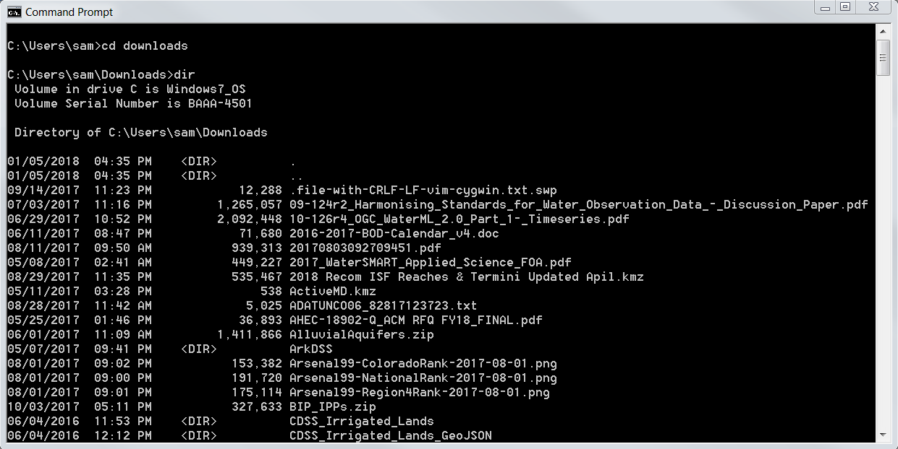
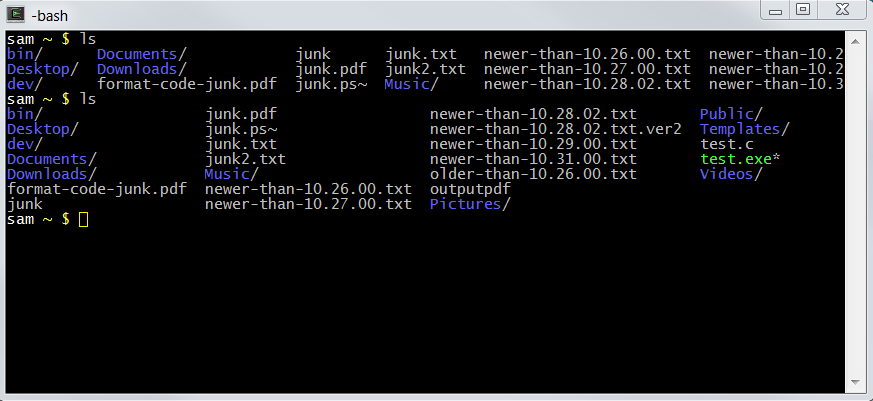

# Learn Linux Shell / Introduction #

There is often a need to perform computational tasks without writing a program in a
"full" programming language (C, Python, Java, C#, etc.).
Examples of tasks include:

* Configuring a user's computer environment to run software
* Performing an ad-hoc task such as searching or translating a data file
* Repetitively running a task
* Prototyping software before writing in another language

In today's computing environments, many people mainly use a web browser,
a virtual desktop, or "apps" in which all interaction occurs through a mouse, finger on a screen, or other interactive action.
Although such interfaces can provide a friendly user experience,
they can also greatly limit what can be done with a computing device.
The use of a ***shell*** via a command line prompt, and shell scripts, can greatly increase efficiency and effectiveness.

Although shell programs and scripts are available on Windows via the Command Prompt and Powershell,
these tools are not discussed in detail in this documentation.
Instead, this documentation focuses on the Linux shell, which has broader availability and applicability,
including Windows and Mac computers.

## What is a Shell Program? ##

A ***shell*** program is a computer program that runs like any other program and provides
a fundamental interface to the computer (rather than performing a specific function as do many programs).
A shell program provides and interface to run computer programs though one of the following mechanisms:

1. graphical user interface
2. command line prompt
3. shell script (really just an extension of the second case, where multiple commands are run from a file)

In this documentation, the focus is on the Linux shell, although comparisons with Windows may be provided for context and perspective.
See also the following comparison of command shells:

* [Comparison of command shells (Wikipedia)](https://en.wikipedia.org/wiki/Comparison_of_command_shells)

Command shells run:

1. commands built into the command shell
2. commands built into the operating system
3. other programs installed on the computer/device

Each of the above behave slightly differently due to the integration with the computing environment.

### Windows Command Shell ###

**This section is provided for Windows users to provide context.**

Windows provides the Windows Command Prompt to run a command shell
(search for "command" in the ***Start*** tool to local the Command Prompt program on Windows).
The command shell program starts a text interface window and
prints a command prompt, which allows system commands to be entered.
The command prompt program then executes the command and displays the prompt again.
The following example shows how the `cd` command has been used to change to the `Downloads` folder
and then the `dir` command has been used to list the contents of the folder.
Multiple commands can be entered in sequence at the prompt to perform tasks.
One or more such Command Prompt windows can be opened to perform tasks.



Type `exit` at the command prompt to close the shell or use the ***X*** in the corner of the window frame.

### Linux Shell ###

A Linux shell program is fundamental to use of a Linux computer.
Users that only use graphical desktops or web browsers may not realize it,
but a Linux shell program is probably doing much of the work behind the scenes.
Software developers, modelers, data analysts, and others often use shell programs to automate work tasks.
Apple Mac computers use a variation of Linux!

The [Installing Shell Software](install) documentation explains how to install Linux shell software (even on Windows).
Before reading that information, suffice it to say that a Linux shell program can be run to provide a command line prompt.
For example, the following Cygwin command shell window (a version of Linux that runs on Windows)
shows how to list files in a home folder using the `ls` command.
One or more command shell windows (also called *terminal* windows) can be opened to perform tasks.



Type `exit` at the command prompt to close the shell or use the ***X*** in the corner of the window frame.

## What is a Shell Script? ##

A shell script is a text file that contains a sequence of commands to run.
Scripts are edited with a text editor program such as `notepad++`.
The script also often contains comments and logic control syntax, such as assigning variables, `if` statements for logic branches,
and `for` loops to execute commands multiple times.
Shell scripts can also contain functions, which are self-contained blocks of code that can be called as needed.

A script is run by typing its name at the command prompt.
As will be discussed later, it may be necessary to type `./scriptname` to run if the `PATH` environment variable does not contain the current folder.

### Windows Batch File ###

**This section is provided for Windows users to provide context.**

Windows batch files are required to have the extension `.bat` to indicate the file type to the Windows operating system.
The following `listfiles.bat` file is a simple batch file to list the contents of the current folder.

**Note that Windows batch files are typically called "batch files" and not "shell scripts" because of historical conventions.**


```bat
@echo off
rem Simple batch file to list files in current folder
dir
```

The first line tells the command shell program to run not echo each line that is run.
Comment lines start with `rem`.

### Linux Shell Script ###

Linux shell scripts may have no extension or may include an extension to indicate the file type,
based on software developer preferences.
On Linux, programs can be run if they have permissions set to executable, regardless of file extension.
The following `listfiles.sh` file is a simple shell script file to list the contents of the current folder.

```sh
#!/bin/sh
# Simple script to list files in current folder
ls
```

The first line indicates which program should be run to run the file, in this case the `sh` shell program
(more on that in the [Shell Script Basics](shell-script-basics) section).
Comments in shell scripts start with the `#` character, and can be anywhere on a line.

## Why Use a Linux Shell? ##

Why would one use a Linux shell, in particular when working on a Windows computer?
Because of the following reasons:

* Some software environments install a Linux shell as part of the software, for example:
	+ Git for Windows, which is used for version control installs the MinGW environment,
	which includes a Bash shell (more on different Linux shells later).
	+ The GNU Fortran environment also installs MinGW and Linux shell.
* Linux shell programs provide more functionality that Windows batch files, especially for complex tasks
(of course batch file experts might debate this).
* Linux shell scripts are portable across many computers, including Linux, Mac, and Windows, whereas
Windows batch files only run on Windows computers.
* Learning Linux and shell scripting, especially in a profession that deals with data and programming,
is a skill that will pay dividends in productivity and career advancement.

## Next Steps

Next sections of this documentation provide additional background on command shells and shell scripts.
